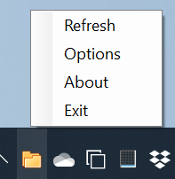
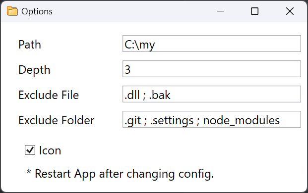
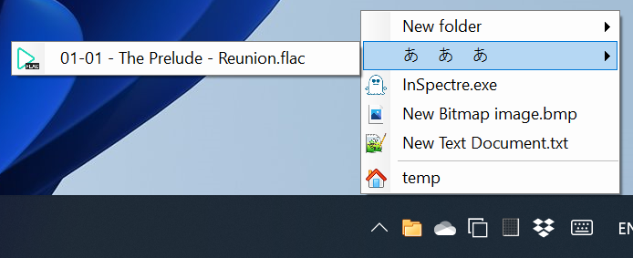

TrayToolbar
===

:rocket: Provide the replacement of add new toolbar function that was cancelled in windows 11. 

## Intro

The Windows 10 provide the convenient function that can make the nested folder to be a custom menu. But it was removed in Windows 11. TrayToolbar is the program provided the similar function by system tray.

*Nested folder to be a custom menu in Windows 10*

## Guide

### Environment

- Windows 10/11
- .NET Desktop Runtime 8.0.0+ ( [Download](https://dotnet.microsoft.com/en-us/download/dotnet/thank-you/runtime-desktop-8.0.3-windows-x64-installer) )

## Instruction 

Download released package and then uncompress it. Running "TrayToolbar.exe" to open the app.

Pay attention to the tray icon at taskbar that the new icon showed.

Right-click mouse :

- Refresh - Refresh left-click menu.
- Options - Config app.
- About - Information about app.
- Exit - Exit app.

*TrayToolbar App & right-click menu*

Click "Options".

You can config the parameters of app:

- Path - the folder which you want to be a menu.
- Depth - the maxima scan depth of nested folder. It is recommended not to exceed 5.
- Exclude File - Filter based on the name at the end of the file. Filtered files will not appear in the menu. Multiple parameters can be separated by semicolons `;`.
- Exclude Folder - Filter based on the name at the end of the folder. Filtered folders will not appear in the menu. Multiple parameters can be separated by semicolons `;`.
- Icon - switch display the icon beside of item.

*Options*

After config options, restart the app.

Left-click mouse and it shows the nested menu mapping to nested folder.

You can click any item if it is:

- Folder - Open the windows explorer by path.
- Files - Open the file with associated app.

Special :

- House Logo - Open the windows explorer by home path.

*The nested menu mapping to nested folder*

Enjoy 😁

## Donate 

[BTC]  bc1qd3889yxkk2tqjvxnxwa8qumr068htctat4ef3c

[ETH]  0xAF5e6b4a618238A9Bf202a78087f6F06351117e1

If this program help you and willing to sponsor me to continue to improve this software, please support me with effective action.

Crowdfunding Features :

1. Complex folder and file filter
2. DPI scale
3. Multi root path
4. Look feel
5. Config sync to cloud
6. Utility that do not slow down the opening menu speed
7. The version without .net core
8. Open source
